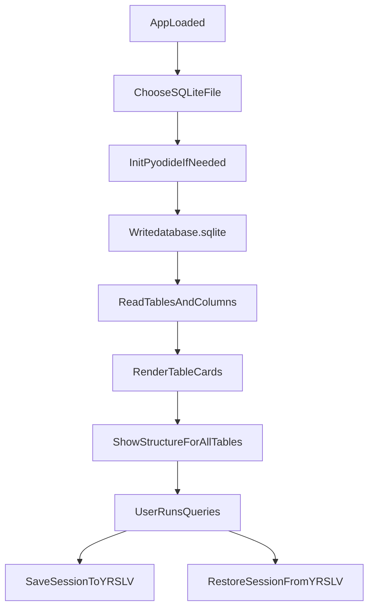
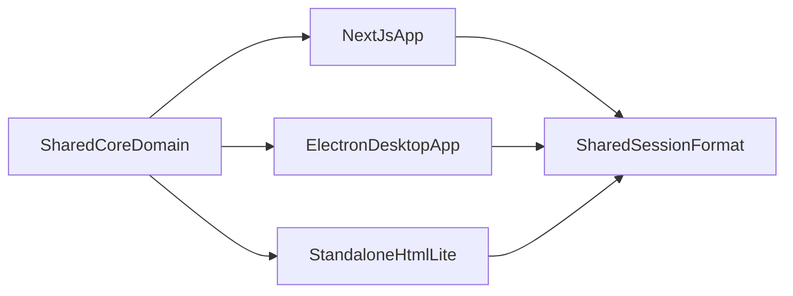

# Document purpose

This document is a rebuild specification for the current `yrSqliteViewer` system.  
Goal: enable a modern AI coding workflow to recreate the existing product behavior as-is (including quirks), then evolve it safely.

# Scope and source of truth

- Primary implementation source: `yrSqliteViewer.html` (single-file app, current working version shows `ver 0.0.3` in UI).
- Supporting style file exists: `yrSqliteViewer-styles.css`, but current HTML also embeds large inline CSS blocks.
- Session sample source: `yrSqliteViewerSession-sample.yrslv`.
- Product context and user-facing guidance source: `README.md`.

# Product definition (current system)

## What the app is

- A browser-based SQLite viewer/query runner.
- Designed for non-technical teaching/learning use.
- Operates by loading a local SQLite file into an in-browser Python runtime (Pyodide).
- Supports saving and restoring sessions that bundle:
  - SQLite DB file
  - SQL query text/history
  - Stored query result snapshots

## What the app is not

- Not a production-grade DB admin tool.
- Not a multi-user app.
- Not currently a full SQL editor with advanced object management.
- Not currently a true offline-first packaged app (depends on CDN assets in current implementation).

# Runtime architecture (current)

## External browser dependencies (CDN)

- Pyodide `v0.23.0`
- JSZip `3.10.1`
- FileSaver.js `2.0.5`
- CodeMirror `5.65.2` core + SQL mode + eclipse theme

## Core runtime model

1. User selects `.sqlite`/`.db` file.
2. File is loaded into browser memory and written to Pyodide FS as `database.sqlite`.
3. Python `sqlite3` executes metadata queries and user SQL.
4. Results are serialized to JSON and returned to JS for rendering.
5. UI maintains query cards and output cards in DOM.

## State variables (JS)

- `pyodideInstance`: singleton runtime, lazy-initialized.
- `queryHistory`: array of query objects with `query`, `timestamp`, `results`.
- `queryInterfaceCount`: current query card count tracker.
- `currentDatabaseName`: active DB filename.
- `tableNames`: table list from schema scan.
- `isSessionSaved`: dirty-state flag used by `beforeunload`.
- `editors`: map of CodeMirror instances keyed by `sqlQuery<id>`.

## High-level flow



# UI specification (current)

## Global page layout

Order from top to bottom:

1. Control panel
2. Database tables header + global table controls
3. Initial no-file instructional message (hidden after DB load)
4. Loading message area
5. Dynamic table cards area
6. SQL commands header + global SQL font controls
7. Dynamic SQL command cards area

## Control panel contents

- Title text: `yrSqliteViewer (ver 0.0.3)` (current working file).
- Small instructions link to repository.
- `Load Database File` pseudo-button (hidden file input label).
- Selected filename text (`no file chosen yet` by default).
- `Save Session` button.
- `Restore Session` pseudo-button (hidden file input label).
- `Clear Session` button.

## Database tables section

Header: `Database Tables`.

Controls:

- `Show Structure (for all tables)`
- `Show Rows (for all tables)`
- Global font controls for table cards:
  - `A-`, `A+`, numeric input (range clamped 0.5 to 3)

Dynamic content:

- One card per table.
- Each card has:
  - `Table: <name>`
  - table-local `A-`, `A+`
  - `Show Structure`
  - `Show Rows`
  - output region (`<tableName>_info`)

## SQL commands section

Header: `SQL Commands`.

Controls:

- Global query interface font controls:
  - `A-`, `A+`, numeric input (range clamped 0.5 to 3)

Dynamic content:

- Starts with one query card labeled `SQL Command 1`.
- Each query card has:
  - local `A-`, `A+`
  - CodeMirror SQL editor area
  - `Run Query` button
  - output region
- Auto-growth behavior:
  - After running a non-empty query in last card, app auto-adds a new blank query card.

# Functional behavior specification

## Load database behavior

Trigger:

- File input event on `sqliteFile`.

Expected behavior:

1. If no file selected:
   - Show error in output area: `Please select a file.`
2. Hide no-file message, show loading message.
3. If not restoring:
   - Reset SQL card area to one fresh query card.
4. Initialize Pyodide/sqlite3 if first run.
5. Write uploaded bytes to `database.sqlite`.
6. Query sqlite metadata:
   - `SELECT name FROM sqlite_master WHERE type='table';`
   - `PRAGMA table_info(<table>)`
7. Render table cards and default each card to structure view.
8. Hide loading message.

## Query execution behavior

Trigger:

- `Run Query` button on a card.
- Keyboard shortcut `Ctrl-Enter` or `Cmd-Enter` in CodeMirror.

Behavior:

1. If Pyodide not initialized: return silently.
2. Read SQL text from relevant CodeMirror editor.
3. If blank after trim: return silently.
4. Execute query in Python:
   - `cursor.execute("""<query>""")`
   - `columns = [description[0] for description in cursor.description]`
   - `rows = cursor.fetchall()`
5. Render HTML table output.
6. Update or append matching `queryHistory` entry by card index.
7. Mark `isSessionSaved = false`.
8. Ensure there is always one blank trailing query card.

Important current limitation:

- The code assumes `cursor.description` exists.
- For non-`SELECT` commands, `cursor.description` may be `None`, causing error output.
- This is one reason current product effectively behaves as `SELECT`-oriented.

## Table structure and row display

### Structure

- `showTableStructure(tableName, columns)` renders a two-column table:
  - Column
  - Type

### Rows

- `showTableData(tableName)` executes:
  - `SELECT * FROM '<tableName>'`
- Renders all rows in a scrollable HTML table.
- On error, shows red error message in table info panel.

### Bulk operations

- `showAllTablesStructure()` loops all table cards and reconstructs column metadata by parsing each structure button `onclick` string (string-parsing based; fragile but current behavior).
- `showAllTablesData()` loops table cards and awaits row loading table-by-table.

## Font-size controls

Implemented at three levels:

1. Per query editor wrapper
2. Per table card
3. Global for all table cards / all query cards

Current clamp behavior:

- Per-card adjustments in `adjustFontSize`: 0.5 to 2 for specific target handling.
- Global setter/adjusters: typically 0.5 to 3.

## Session save behavior (`.yrslv`)

Trigger:

- `Save Session` button.

Flow:

1. Prompt for base filename (default `yrSqliteViewerSession`).
2. Rebuild `queryHistory` from current editor contents:
   - Saves non-empty query cards only.
   - Preserves prior results when available.
3. Build JSON metadata file.
4. Build TXT summary file.
5. Read current `database.sqlite` from Pyodide FS.
6. Zip JSON + TXT + DB into one `.yrslv`.
7. Download with FileSaver.
8. Mark session saved.

## Session restore behavior (`.yrslv`)

Trigger:

- `Restore Session` file input change.

Flow:

1. Read archive with JSZip.
2. Locate `.json` entry.
3. Parse and validate:
   - `jsonFormatVersion` must equal `"0.1"`.
4. Extract DB by `databaseName`.
5. Write DB into Pyodide FS.
6. Load database via `loadDatabase(file, true)` (restore mode).
7. Recreate query cards from session queries.
8. Re-hydrate editor text and stored results tables.
9. Add one extra blank query card at end.
10. Reset restore input value for reselecting same file.

## Clear session behavior

Trigger:

- `Clear Session` button.

Flow:

1. Confirmation dialog.
2. Reset in-memory state.
3. Clear table list.
4. Reset to one query card.
5. Reset selected filename label.
6. Re-show initial no-file instructional message.

## Unsaved-change warning

- `window.onbeforeunload` prompts user if:
  - `queryHistory.length > 0`
  - and `isSessionSaved === false`

# Session file format specification (current)

## Container

- Extension: `.yrslv`
- Actual format: ZIP archive

## Required archive members

- One JSON metadata file (name usually `<baseFilename>.json`)
- One TXT summary file (name usually `<baseFilename>.txt`)
- One SQLite file (name equals `databaseName`)

## JSON schema (current)

```json
{
  "jsonFormatVersion": "0.1",
  "yrSqliteViewerVersion": "0.1",
  "databaseName": "sampleDatabase-books-v025.sqlite",
  "queries": [
    {
      "query": "select ...",
      "timestamp": "2025-06-26T15:53:40.968Z",
      "results": {
        "columns": ["colA", "colB"],
        "rows": [["v1", "v2"]]
      }
    }
  ]
}
```

Notes:

- `yrSqliteViewerVersion` in saved JSON is currently hardcoded to `"0.1"` and does not match displayed UI version.
- `results` may be `null` for query text never executed before save.

# Rebuild fidelity requirements (must preserve for "same functionality")

To claim equivalent behavior, the rebuilt app must preserve:

1. Load/inspect SQLite from local file.
2. Table cards with structure and row actions.
3. SQL query cards with run button and keyboard shortcuts.
4. Auto-add blank query card after executing last non-empty query.
5. Save/restore `.yrslv` with ZIP JSON/TXT/DB.
6. Restore previously captured query results tables.
7. Font scaling controls (global and local).
8. Unsaved-session warning behavior.
9. Clear-session reset flow.

# Current known quirks and technical debt (preserve or explicitly fix)

1. Mixed textarea/CodeMirror markup patterns due iterative edits.
2. Some duplicated/legacy commented blocks remain.
3. `showAllTablesStructure()` depends on regex parsing `onclick` string.
4. Query execution assumes resultset exists; non-SELECT commands error.
5. Version values are inconsistent:
   - UI currently shows `0.0.3`
   - session JSON writes `"yrSqliteViewerVersion": "0.1"`
6. Single large HTML file combines styles, markup, and logic.
7. CDN dependency means pure offline use is limited unless assets cached.

# Screenshot plan and placeholders

If screenshots are available, include at minimum these states in future revisions of this spec:

1. Initial page before DB load (no-file instructional message visible).
2. After loading sample DB (table cards visible).
3. Structure view example for one table.
4. Rows view example for one table.
5. Multiple SQL command cards with outputs.
6. Save session prompt and downloaded file confirmation.
7. Restored session showing previously saved queries and outputs.

Suggested filenames under `docs/images/spec-current/`:

- `01-initial-no-db.png`
- `02-db-loaded-table-cards.png`
- `03-table-structure.png`
- `04-table-rows.png`
- `05-multi-query-output.png`
- `06-save-session.png`
- `07-restore-session.png`

# Acceptance test checklist for "same functionality" rebuild

## Functional smoke tests

- Load `sampleDatabase-books-v025.sqlite`.
- Confirm table list appears.
- Confirm "Show Structure (for all tables)" renders all structure sections.
- Confirm "Show Rows (for all tables)" renders all row tables.
- Run at least 3 SELECT queries in different cards.
- Confirm automatic blank next SQL card appears.
- Save session as `.yrslv`.
- Reload app and restore session.
- Confirm query text and prior results are restored.

## Compatibility tests

- Chrome latest (primary target, existing recommendation).
- At least one other Chromium-based browser.

## Data fidelity tests

- Compare row/column counts for representative tables between original and rebuilt app.
- Validate restored session JSON schema and content fields.

# Future modifications specification (requested)

This section specifies desired enhancements **after** preserving current behavior baseline.

## M1: Full SQLite command support

### Goal

Support full SQLite command set (DDL, DML, PRAGMA, transaction control), not only SELECT-style outputs.

### Requirements

- Execute commands like:
  - `CREATE TABLE`
  - `INSERT/UPDATE/DELETE`
  - `ALTER TABLE`
  - `DROP`
  - `PRAGMA`
  - transaction commands
- For non-result commands, display structured success metadata:
  - rows affected
  - last insert rowid (if available)
  - execution time
- Allow multi-statement execution with clear per-statement status/output blocks.
- Add safe-guard mode option for teaching:
  - read-only mode toggle
  - confirm destructive statements

## M2: Tabbed collections of SQL command windows

### Goal

Allow grouping SQL command cards into named tab collections; support multiple collections.

### Requirements

- Introduce "workspace tabs" (collection-level tabs).
- Each collection contains multiple SQL command cards.
- User can:
  - create/delete/rename collection tabs
  - reorder collections
  - duplicate collection
  - move SQL cards between collections
- Session format must persist full tab/collection structure.

## M3: Expand/collapse for teaching visibility control

### Goal

Enable quick focus while preserving ability to view many outputs at once.

### Requirements

1. Table area:
   - Each table card must have collapse/expand for output panel.
   - Global expand/collapse all for table outputs.
2. SQL area:
   - Each SQL card must have independent collapse/expand for:
     - query editor panel
     - output panel
   - Global controls for expand/collapse all SQL editors and outputs.

## M4: Mermaid ER diagrams in sessions

### Goal

Allow saving/rendering ER diagrams as Mermaid text with session portability.

### Requirements

- Add Mermaid editor panel(s) in UI.
- Support rendering Mermaid diagrams inline.
- Persist diagrams in session archive JSON.
- Restore diagrams exactly on session load.
- Include export options:
  - Mermaid source text
  - rendered image (optional future enhancement)

## M5: Multi-target architecture (Next.js + offline options)

### Goal

Build a modern app architecture that supports:

1. Next.js connected mode
2. Disconnected desktop app (Electron or similar) for macOS + Windows
3. Optional pure `.html` mode (possibly SELECT-only)

### Requirements

- Define shared core domain package:
  - SQL execution abstraction
  - session schema
  - query history model
  - table metadata model
- Ensure cross-target session compatibility:
  - same session format family
  - forward/backward compatibility strategy
- Connected mode can add online-only features later without breaking offline core.
- Desktop app must function fully disconnected.
- Pure HTML mode may have constrained feature set (acceptable).

### Suggested target architecture



# Proposed phased implementation plan (post-spec)

1. Freeze baseline:
   - lock current behavior with acceptance tests and golden session files.
2. Rebuild parity:
   - implement same-functionality modern codebase first.
3. Add M1 (full SQL support) with test matrix.
4. Add M2 + M3 UI structure.
5. Add M4 Mermaid session support.
6. Add M5 multi-target packaging and compatibility testing.

# Definition of done for refactor program

- A new codebase reproduces baseline functionality with documented parity evidence.
- New features M1 to M5 implemented with user guides and migration notes.
- Session compatibility rules documented and tested.
- Non-technical student workflow remains simple and reliable.
